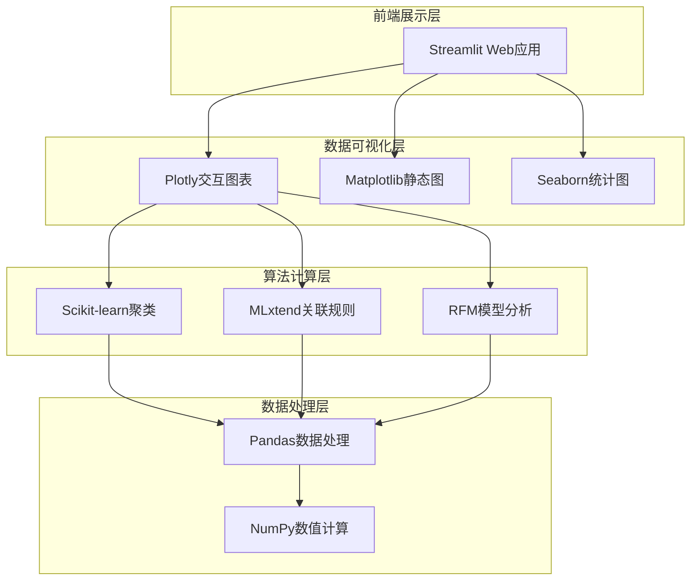
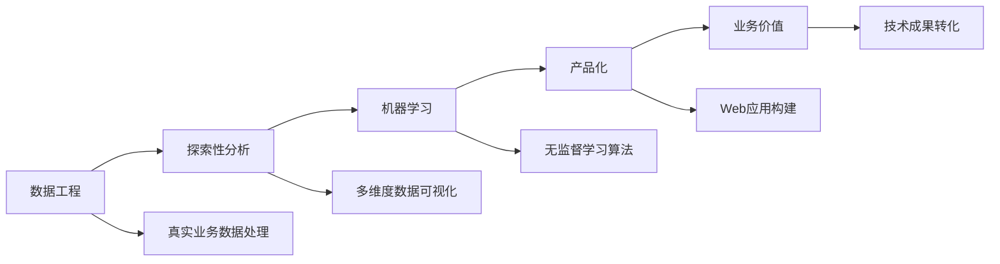

# 🛒 U团团校园团购智能分析系统

<div align="center">


**基于机器学习算法的校园团购服务平台分析工具**

*实现用户行为分析、商品推荐和用户分群功能*

[🚀 快速开始](#-快速开始) • [📊 功能特性](#-功能模块) • [🔧 技术架构](#-技术架构) • [🚨 问题解答](#-常见问题) • [📞 技术支持](#-技术支持)

---

<!-- 这里可以添加项目主界面截图 -->
<!--  -->

</div>

## 🎯 项目简介

> 🌟 **为校园团购场景量身定制的智能分析解决方案**

本项目专注于校园团购数据的深度挖掘与智能分析，通过先进的机器学习算法，为团购平台提供全方位的数据洞察和决策支持。

### 🎪 核心亮点

| 特性 | 描述 | 技术实现 |
|:----:|:-----|:---------|
| 🔍 | **智能用户画像** | RFM模型 + K-Means聚类 |
| 🎯 | **精准商品推荐** | Apriori关联规则算法 |
| 📊 | **多维数据可视化** | Plotly交互式图表 |
| ⚡ | **实时性能监控** | Streamlit缓存优化 |

## 🚀 快速开始

### 📋 环境要求

<table>
<tr>
<td><strong>Python版本</strong></td>
<td>3.8 或更高版本</td>
</tr>
<tr>
<td><strong>内存要求</strong></td>
<td>推荐 4GB+ RAM</td>
</tr>
<tr>
<td><strong>浏览器支持</strong></td>
<td>Chrome、Firefox、Safari、Edge</td>
</tr>
</table>

### 🛠️ 安装步骤

#### 1. **检查Python环境**
```bash
# 确认Python版本
python --version
# 输出应为: Python 3.8.x 或更高
```

#### 2. **获取项目代码**
```bash
# 方式一：Git克隆（推荐）
git clone https://github.com/your-username/u-tuantuan-analysis.git
cd u-tuantuan-analysis

# 方式二：直接下载
# 将 app.py 和 requirements.txt 放在同一文件夹
```

#### 3. **创建虚拟环境**
```bash
# 创建虚拟环境
python -m venv u_tuantuan_env

# 激活虚拟环境
# Windows 用户
u_tuantuan_env\Scripts\activate

# macOS/Linux 用户  
source u_tuantuan_env/bin/activate
```

#### 4. **安装依赖包**
```bash
# 升级pip（推荐）
python -m pip install --upgrade pip

# 安装项目依赖
pip install -r requirements.txt
```

### 🎬 启动应用

```bash
# 启动Streamlit应用
streamlit run app.py
```

<div align="center">

🌐 **应用地址**: http://localhost:8501

*应用将自动在默认浏览器中打开*

</div>

---

## 📊 功能模块

### 🎯 1. 用户行为数据可视化

<details>
<summary><strong>点击展开详细功能</strong></summary>

<!-- 这里可以添加用户行为分析的截图 -->
<!--  -->

- **🍎 热门商品分析**
  - 识别最受欢迎的水果品类
  - 销量排行榜可视化
  - 品类偏好度分析

- **⏰ 时间趋势分析**
  - 发现订单高峰时段
  - 周期性规律挖掘
  - 季节性变化趋势

- **🏫 校区对比分析**
  - 多校区销售对比
  - 地域偏好差异分析
  - 市场渗透率评估

- **📈 关键指标监控**
  - 客单价实时监控
  - 用户活跃度追踪
  - 转化率分析

</details>

### 🤖 2. 关联规则挖掘与推荐

<details>
<summary><strong>点击展开详细功能</strong></summary>

<!-- 这里可以添加推荐系统的截图 -->
<!--  -->

- **🔬 Apriori算法**
  - 挖掘商品间关联关系
  - 支持度阈值自动优化
  - 规则质量评估

- **🧩 频繁项集分析**
  - 发现热门商品组合
  - 购买篮子分析
  - 交叉销售机会识别

- **🎯 推荐规则生成**
  - 基于置信度筛选规则
  - 提升度有效性验证
  - 个性化推荐策略

- **📊 可视化展示**
  - 网络图展示商品关联
  - 热力图显示关联强度
  - 交互式规则浏览

</details>

### 👥 3. 用户分群与营销策略

<details>
<summary><strong>点击展开详细功能</strong></summary>

<!-- 这里可以添加用户分群的截图 -->
<!--  -->

- **📊 RFM模型构建**
  - **R** - Recency：最近购买时间
  - **F** - Frequency：购买频次统计
  - **M** - Monetary：消费金额分析

- **🎯 K-Means智能聚类**
  - 自动识别用户群体
  - 最优聚类数确定
  - 用户价值分层

- **💰 精准营销策略**
  - 高价值用户维护策略
  - 潜力用户激活方案
  - 流失用户召回计划

- **🌐 3D可视化分析**
  - 三维用户分布图
  - 群体特征对比
  - 营销效果预测

</details>

### 📋 4. 综合分析报告

<details>
<summary><strong>点击展开详细功能</strong></summary>

<!-- 这里可以添加分析报告的截图 -->
<!--  -->

- **🎯 项目成果总结**
  - 关键发现整合汇总
  - 数据洞察提炼
  - 业务建议输出

- **💎 业务价值评估**
  - ROI量化分析
  - 业务指标提升评估
  - 成本效益计算

- **🏗️ 技术架构展示**
  - 算法技术栈说明
  - 系统架构图解
  - 性能优化方案

- **🚀 未来发展规划**
  - 功能扩展建议
  - 技术升级路线
  - 业务拓展方向

</details>

---

## 🔧 技术架构

### 💻 核心技术栈

<div align="center">



</div>

### 🧠 算法详解

#### 🔍 **Apriori关联规则算法**

| 指标 | 公式 | 含义 |
|:----:|:-----|:-----|
| **支持度** | `Support(A→B) = P(A∪B)` | 商品组合出现的频率 |
| **置信度** | `Confidence(A→B) = P(B\|A)` | 购买A后购买B的概率 |
| **提升度** | `Lift(A→B) = P(B\|A)/P(B)` | 关联规则的有效性度量 |

#### 🎯 **K-Means聚类算法**

- **🔧 RFM特征工程**
  - **Recency**: 最近购买时间间隔
  - **Frequency**: 购买频次统计
  - **Monetary**: 累计消费金额

- **📏 标准化处理**: 消除量纲影响，确保聚类效果
- **📐 肘部法则**: 自动确定最优聚类数量

### ⚡ 性能优化策略

```python
# 核心优化技术
@st.cache_data  # 数据缓存优化
def load_data():
    """缓存数据生成过程，提升响应速度"""
    
# Plotly交互图表 - 更好的用户体验
# 模块化设计 - 便于功能扩展和维护
```

---

## 🚨 常见问题

<details>
<summary><strong>❓ 运行时出现包导入错误？</strong></summary>

**解决方案：**
```bash
# 确保已安装所有依赖包
pip install mlxtend scikit-learn pandas plotly streamlit

# 如果仍有问题，尝试重新安装
pip uninstall mlxtend
pip install mlxtend
```

</details>

<details>
<summary><strong>🖼️ 图表显示不完整？</strong></summary>

**解决方案：**
- 调整浏览器窗口大小
- 刷新页面重新加载
- 清除浏览器缓存
- 尝试其他浏览器

</details>

<details>
<summary><strong>📊 数据量较小导致关联规则为空？</strong></summary>

**解决方案：**
- 点击"重新生成数据"按钮
- 调整支持度和置信度阈值
- 增加模拟数据样本量
- 这是正常现象，真实数据会有更好效果

</details>

<details>
<summary><strong>💾 虚拟环境相关问题？</strong></summary>

**解决方案：**
```bash
# 如果虚拟环境激活失败
# Windows
.\u_tuantuan_env\Scripts\activate.bat

# 或者使用conda
conda create -n u_tuantuan python=3.8
conda activate u_tuantuan
```

</details>

---

## 📈 性能监控

### 🎯 关键性能指标

| 指标 | 目标值 | 优化方案 |
|:----:|:------:|:---------|
| **页面加载时间** | < 3秒 | 数据缓存 + 懒加载 |
| **图表渲染速度** | < 2秒 | Plotly优化 + 数据采样 |
| **内存使用率** | < 80% | 数据流式处理 |
| **用户体验评分** | > 4.5/5 | 交互优化 + 响应式设计 |

### 🔧 优化技术

- **🚀 `@st.cache_data`**: 智能数据缓存机制
- **📊 Plotly图表**: 高性能交互式可视化
- **🎯 模块化设计**: 便于功能扩展和性能调优
- **💾 内存优化**: 大数据分批处理策略

---

## 🎓 学习价值

<div align="center">

### 📚 **完整的数据科学流程实践**

</div>



### 🌟 核心技能收获

1. **🔧 数据工程能力**
   - 数据清洗与预处理
   - 特征工程与变换
   - 数据质量管控

2. **🔍 探索性数据分析**
   - 多维度数据可视化
   - 统计描述与推断
   - 业务洞察挖掘

3. **🤖 机器学习实践**
   - 无监督学习算法应用
   - 模型评估与优化
   - 算法参数调优

4. **🚀 产品化开发**
   - Web应用快速构建
   - 用户交互设计
   - 性能优化实现

5. **💡 业务理解转化**
   - 技术成果业务化
   - 数据驱动决策
   - 商业价值创造

---

## 📞 技术支持

<div align="center">

### 🔗 **获取帮助的方式**

</div>

| 问题类型 | 推荐解决方案 | 链接地址 |
|:--------:|:-------------|:---------| 
| **📖 技术文档** | 查看官方文档 | [Streamlit文档](https://docs.streamlit.io/) |
| **🔧 算法问题** | 参考学习资源 | [Scikit-learn](https://scikit-learn.org/) • [MLxtend](http://rasbt.github.io/mlxtend/) |

### 📋 **问题排查步骤**

1. **🔍 检查环境配置**
   - Python版本兼容性
   - 依赖包完整性
   - 虚拟环境激活状态

2. **📚 查阅官方文档**
   - Streamlit使用指南
   - Scikit-learn算法文档
   - Plotly图表配置

3. **💬 社区求助**
   - Stack Overflow搜索
   - GitHub Issues查询
   - 技术论坛讨论

<div align="center">

---

### ⭐ **如果这个项目对你有帮助，请给个Star支持一下！**

[![GitHub stars]
[![GitHub forks]  
# 🛒 U团团校园团购智能分析系统

<div align="center">


**基于机器学习算法的校园团购服务平台分析工具**

*实现用户行为分析、商品推荐和用户分群功能*

[🚀 快速开始](#-快速开始) • [📊 功能特性](#-功能模块) • [🔧 技术架构](#-技术架构) • [🚨 问题解答](#-常见问题) • [📞 技术支持](#-技术支持)

---

<!-- 这里可以添加项目主界面截图 -->
<!--  -->

</div>

## 🎯 项目简介

> 🌟 **为校园团购场景量身定制的智能分析解决方案**

本项目专注于校园团购数据的深度挖掘与智能分析，通过先进的机器学习算法，为团购平台提供全方位的数据洞察和决策支持。

### 🎪 核心亮点

| 特性 | 描述 | 技术实现 |
|:----:|:-----|:---------|
| 🔍 | **智能用户画像** | RFM模型 + K-Means聚类 |
| 🎯 | **精准商品推荐** | Apriori关联规则算法 |
| 📊 | **多维数据可视化** | Plotly交互式图表 |
| ⚡ | **实时性能监控** | Streamlit缓存优化 |

## 🚀 快速开始

### 📋 环境要求

<table>
<tr>
<td><strong>Python版本</strong></td>
<td>3.8 或更高版本</td>
</tr>
<tr>
<td><strong>内存要求</strong></td>
<td>推荐 4GB+ RAM</td>
</tr>
<tr>
<td><strong>浏览器支持</strong></td>
<td>Chrome、Firefox、Safari、Edge</td>
</tr>
</table>

### 🛠️ 安装步骤

#### 1. **检查Python环境**
```bash
# 确认Python版本
python --version
# 输出应为: Python 3.8.x 或更高
```

#### 2. **获取项目代码**
```bash
# 方式一：Git克隆（推荐）
git clone https://github.com/your-username/u-tuantuan-analysis.git
cd u-tuantuan-analysis

# 方式二：直接下载
# 将 app.py 和 requirements.txt 放在同一文件夹
```

#### 3. **创建虚拟环境**
```bash
# 创建虚拟环境
python -m venv u_tuantuan_env

# 激活虚拟环境
# Windows 用户
u_tuantuan_env\Scripts\activate

# macOS/Linux 用户  
source u_tuantuan_env/bin/activate
```

#### 4. **安装依赖包**
```bash
# 升级pip（推荐）
python -m pip install --upgrade pip

# 安装项目依赖
pip install -r requirements.txt
```

### 🎬 启动应用

```bash
# 启动Streamlit应用
streamlit run app.py
```

<div align="center">

🌐 **应用地址**: http://localhost:8501

*应用将自动在默认浏览器中打开*

</div>

---

## 📊 功能模块

### 🎯 1. 用户行为数据可视化

<details>
<summary><strong>点击展开详细功能</strong></summary>

<!-- 这里可以添加用户行为分析的截图 -->
<!--  -->

- **🍎 热门商品分析**
  - 识别最受欢迎的水果品类
  - 销量排行榜可视化
  - 品类偏好度分析

- **⏰ 时间趋势分析**
  - 发现订单高峰时段
  - 周期性规律挖掘
  - 季节性变化趋势

- **🏫 校区对比分析**
  - 多校区销售对比
  - 地域偏好差异分析
  - 市场渗透率评估

- **📈 关键指标监控**
  - 客单价实时监控
  - 用户活跃度追踪
  - 转化率分析

</details>

### 🤖 2. 关联规则挖掘与推荐

<details>
<summary><strong>点击展开详细功能</strong></summary>

<!-- 这里可以添加推荐系统的截图 -->
<!--  -->

- **🔬 Apriori算法**
  - 挖掘商品间关联关系
  - 支持度阈值自动优化
  - 规则质量评估

- **🧩 频繁项集分析**
  - 发现热门商品组合
  - 购买篮子分析
  - 交叉销售机会识别

- **🎯 推荐规则生成**
  - 基于置信度筛选规则
  - 提升度有效性验证
  - 个性化推荐策略

- **📊 可视化展示**
  - 网络图展示商品关联
  - 热力图显示关联强度
  - 交互式规则浏览

</details>

### 👥 3. 用户分群与营销策略

<details>
<summary><strong>点击展开详细功能</strong></summary>

<!-- 这里可以添加用户分群的截图 -->
<!--  -->

- **📊 RFM模型构建**
  - **R** - Recency：最近购买时间
  - **F** - Frequency：购买频次统计
  - **M** - Monetary：消费金额分析

- **🎯 K-Means智能聚类**
  - 自动识别用户群体
  - 最优聚类数确定
  - 用户价值分层

- **💰 精准营销策略**
  - 高价值用户维护策略
  - 潜力用户激活方案
  - 流失用户召回计划

- **🌐 3D可视化分析**
  - 三维用户分布图
  - 群体特征对比
  - 营销效果预测

</details>

### 📋 4. 综合分析报告

<details>
<summary><strong>点击展开详细功能</strong></summary>

<!-- 这里可以添加分析报告的截图 -->
<!--  -->

- **🎯 项目成果总结**
  - 关键发现整合汇总
  - 数据洞察提炼
  - 业务建议输出

- **💎 业务价值评估**
  - ROI量化分析
  - 业务指标提升评估
  - 成本效益计算

- **🏗️ 技术架构展示**
  - 算法技术栈说明
  - 系统架构图解
  - 性能优化方案

- **🚀 未来发展规划**
  - 功能扩展建议
  - 技术升级路线
  - 业务拓展方向

</details>

---

## 🔧 技术架构

### 💻 核心技术栈

<div align="center">


</div>

### 🧠 算法详解

#### 🔍 **Apriori关联规则算法**

| 指标 | 公式 | 含义 |
|:----:|:-----|:-----|
| **支持度** | `Support(A→B) = P(A∪B)` | 商品组合出现的频率 |
| **置信度** | `Confidence(A→B) = P(B\|A)` | 购买A后购买B的概率 |
| **提升度** | `Lift(A→B) = P(B\|A)/P(B)` | 关联规则的有效性度量 |

#### 🎯 **K-Means聚类算法**

- **🔧 RFM特征工程**
  - **Recency**: 最近购买时间间隔
  - **Frequency**: 购买频次统计
  - **Monetary**: 累计消费金额

- **📏 标准化处理**: 消除量纲影响，确保聚类效果
- **📐 肘部法则**: 自动确定最优聚类数量

### ⚡ 性能优化策略

```python
# 核心优化技术
@st.cache_data  # 数据缓存优化
def load_data():
    """缓存数据生成过程，提升响应速度"""
    
# Plotly交互图表 - 更好的用户体验
# 模块化设计 - 便于功能扩展和维护
```

---

## 🚨 常见问题

<details>
<summary><strong>❓ 运行时出现包导入错误？</strong></summary>

**解决方案：**
```bash
# 确保已安装所有依赖包
pip install mlxtend scikit-learn pandas plotly streamlit

# 如果仍有问题，尝试重新安装
pip uninstall mlxtend
pip install mlxtend
```

</details>

<details>
<summary><strong>🖼️ 图表显示不完整？</strong></summary>

**解决方案：**
- 调整浏览器窗口大小
- 刷新页面重新加载
- 清除浏览器缓存
- 尝试其他浏览器

</details>

<details>
<summary><strong>📊 数据量较小导致关联规则为空？</strong></summary>

**解决方案：**
- 点击"重新生成数据"按钮
- 调整支持度和置信度阈值
- 增加模拟数据样本量
- 这是正常现象，真实数据会有更好效果

</details>

<details>
<summary><strong>💾 虚拟环境相关问题？</strong></summary>

**解决方案：**
```bash
# 如果虚拟环境激活失败
# Windows
.\u_tuantuan_env\Scripts\activate.bat

# 或者使用conda
conda create -n u_tuantuan python=3.8
conda activate u_tuantuan
```

</details>

---

## 📈 性能监控

### 🎯 关键性能指标

| 指标 | 目标值 | 优化方案 |
|:----:|:------:|:---------|
| **页面加载时间** | < 3秒 | 数据缓存 + 懒加载 |
| **图表渲染速度** | < 2秒 | Plotly优化 + 数据采样 |
| **内存使用率** | < 80% | 数据流式处理 |
| **用户体验评分** | > 4.5/5 | 交互优化 + 响应式设计 |

### 🔧 优化技术

- **🚀 `@st.cache_data`**: 智能数据缓存机制
- **📊 Plotly图表**: 高性能交互式可视化
- **🎯 模块化设计**: 便于功能扩展和性能调优
- **💾 内存优化**: 大数据分批处理策略

---

## 🎓 学习价值

<div align="center">

### 📚 **完整的数据科学流程实践**

</div>


### 🌟 核心技能收获

1. **🔧 数据工程能力**
   - 数据清洗与预处理
   - 特征工程与变换
   - 数据质量管控

2. **🔍 探索性数据分析**
   - 多维度数据可视化
   - 统计描述与推断
   - 业务洞察挖掘

3. **🤖 机器学习实践**
   - 无监督学习算法应用
   - 模型评估与优化
   - 算法参数调优

4. **🚀 产品化开发**
   - Web应用快速构建
   - 用户交互设计
   - 性能优化实现

5. **💡 业务理解转化**
   - 技术成果业务化
   - 数据驱动决策
   - 商业价值创造

---

## 📞 技术支持

<div align="center">

### 🔗 **获取帮助的方式**

</div>

| 问题类型 | 推荐解决方案 | 链接地址 |
|:--------:|:-------------|:---------|
| **🐛 Bug反馈** | 提交GitHub Issue | [Issues页面](https://github.com/your-username/u-tuantuan-analysis/issues) |
| **💡 功能建议** | 发起Discussion | [讨论区](https://github.com/your-username/u-tuantuan-analysis/discussions) |
| **📖 技术文档** | 查看官方文档 | [Streamlit文档](https://docs.streamlit.io/) |
| **🔧 算法问题** | 参考学习资源 | [Scikit-learn](https://scikit-learn.org/) • [MLxtend](http://rasbt.github.io/mlxtend/) |

### 📋 **问题排查步骤**

1. **🔍 检查环境配置**
   - Python版本兼容性
   - 依赖包完整性
   - 虚拟环境激活状态

2. **📚 查阅官方文档**
   - Streamlit使用指南
   - Scikit-learn算法文档
   - Plotly图表配置

3. **💬 社区求助**
   - Stack Overflow搜索
   - GitHub Issues查询
   - 技术论坛讨论

<div align="center">

---

### ⭐ **如果这个项目对你有帮助，请给个Star支持一下！**

[](https://github.com/your-username/u-tuantuan-analysis)
[](https://github.com/your-username/u-tuantuan-analysis/fork)

**Made with ❤️ by 张梦昂**                          

</div>
